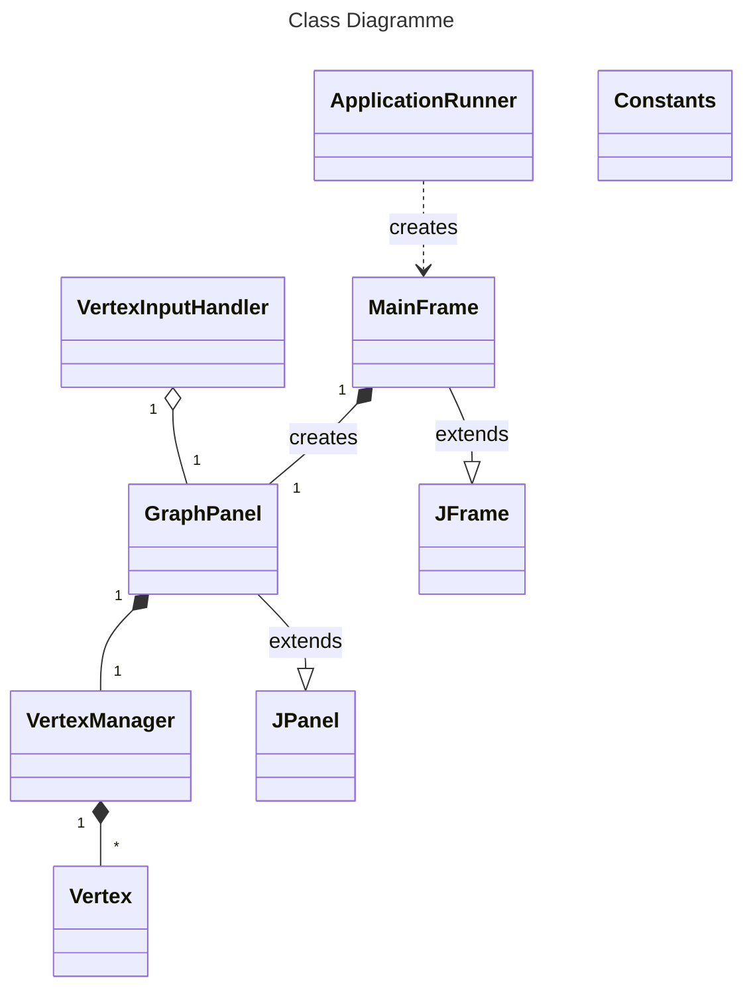

# Graph visualiser

The project will be a simple graph visualiser that can be used to create, edit and visualise graphs.

It is a part of the Java Core course on JetBrains Academy (Hyperskill), using Swing, and is a desktop application.

It is a Work In Progress.

